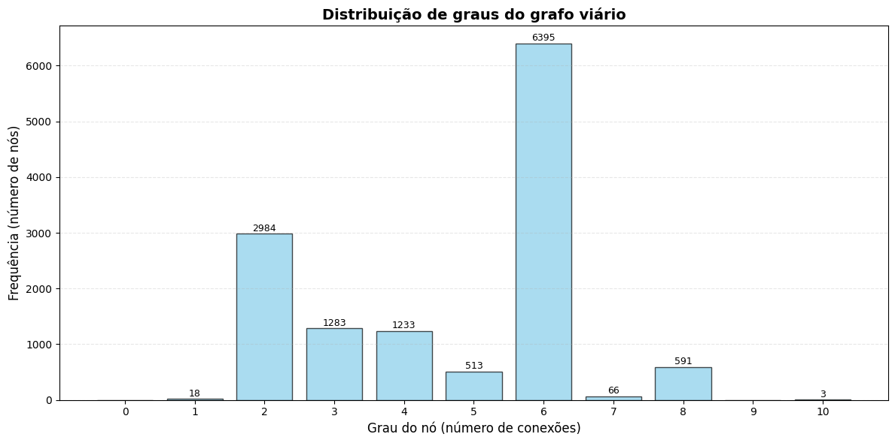
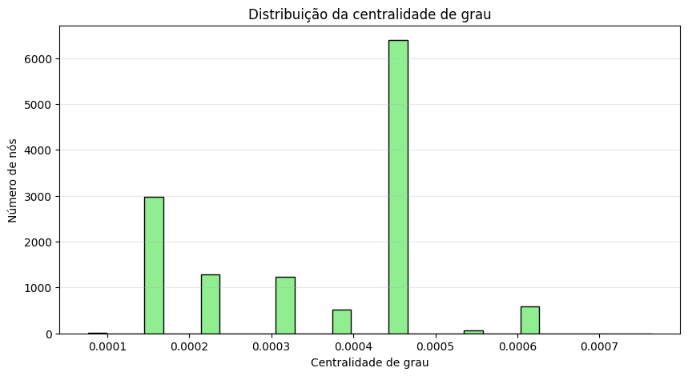

# Análise de rede Comida di Buteco JF

### Introdução

Este notebook analisa a rede viária de Juiz de Fora (MG) a partir das coordenadas dos 40 bares participantes do concurso "Comida di Buteco JF 2026". 

O objetivo é caracterizar a estrutura do grafo, identificar interseções movimentadas e avaliar a acessibilidade dos bares na rede viária.

### Objetivos específicos

- Construir o grafo viário da região central de JF (raio de 25 km)
- Calcular métricas básicas (ordem, tamanho, densidade, graus)
- Identificar nós com alta centralidade
- Verificar quantos bares estão próximos a interseções movimentadas (grau ≥ 6)
- Fornecer base para roteirização e análises futuras

### Importamos as bibliotecas


```python
import pandas as pd
import numpy as np
import osmnx as ox
import networkx as nx
import folium
from folium.plugins import Fullscreen
from sklearn.neighbors import NearestNeighbors
import matplotlib.pyplot as plt
import warnings
warnings.filterwarnings('ignore')

```

### Verificamos as versões


```python
print(f"NetworkX version: {nx.__version__}")
print(f"OSMnx version: {ox.__version__}")
print(f"Folium version: {folium.__version__}")
```

    NetworkX version: 3.6.1
    OSMnx version: 2.1.0
    Folium version: 0.18.0


## Carregamos e inspecionamos os dados dos bares


**Carregamos a lista de bares**


```python
gdf = pd.read_csv("lista_bares.csv")
X = np.array(gdf[['latitude', 'longitude']])
```

**Inspecionamos os dados**


```python
print("=== Informações do dataset ===\n")
gdf.info()

print("\n=== Primeiras 5 coordenadas (lat, lon) ===\n")
print(X[:5])

print(f"\nTotal de bares carregados: {len(gdf)}")
print(f"Colunas disponíveis: {list(gdf.columns)}")
```

    === Informações do dataset ===
    
    <class 'pandas.core.frame.DataFrame'>
    RangeIndex: 40 entries, 0 to 39
    Data columns (total 9 columns):
     #   Column         Non-Null Count  Dtype  
    ---  ------         --------------  -----  
     0   Name           40 non-null     object 
     1   longitude      40 non-null     float64
     2   latitude       40 non-null     float64
     3   Endereço       40 non-null     object 
     4   Petisco        40 non-null     object 
     5   Contato        40 non-null     object 
     6   Instagram      40 non-null     object 
     7   Descrição      40 non-null     object 
     8   Funcionamento  40 non-null     object 
    dtypes: float64(2), object(7)
    memory usage: 2.9+ KB
    
    === Primeiras 5 coordenadas (lat, lon) ===
    
    [[-21.7819995 -43.2989666]
     [-21.7365987 -43.3609957]
     [-21.7586111 -43.3472222]
     [-21.766567  -43.3723106]
     [-21.7756168 -43.378489 ]]
    
    Total de bares carregados: 40
    Colunas disponíveis: ['Name', 'longitude', 'latitude', 'Endereço', 'Petisco', 'Contato', 'Instagram', 'Descrição', 'Funcionamento']


### Criamos o grafo viário


```python
# Calcular o centro geográfico dos bares
center = (X[:, 0].mean(), X[:, 1].mean())
print(f"Centro da região: latitude {center[0]:.6f}, longitude {center[1]:.6f}")

# Criar o grafo a partir do ponto central (raio de 25 km)
print("\nCriando grafo viário... Isso pode levar alguns segundos.")
G = ox.graph_from_point(center, dist=25000, network_type='drive')

# Adicionar atributos de velocidade e tempo de viagem
G = ox.add_edge_speeds(G)
G = ox.add_edge_travel_times(G)

print(f"\n✅ Grafo criado com sucesso!")
```

    Centro da região: latitude -21.758952, longitude -43.359572
    
    Criando grafo viário... Isso pode levar alguns segundos.
    
    ✅ Grafo criado com sucesso!


### Estatísticas básicas do grafo


```python
print("=== Estatísticas básicas do grafo ===\n")
print(f"Tipo do grafo: {type(G).__name__}")
print(f"Direcionado? {G.is_directed()}")
print(f"Nós (ordem): {G.number_of_nodes():,}")
print(f"Arestas (tamanho): {G.number_of_edges():,}")
print(f"Ponderado? {len(list(G.edges(data=True)))} > 0")
```

    === Estatísticas básicas do grafo ===
    
    Tipo do grafo: MultiDiGraph
    Direcionado? True
    Nós (ordem): 13,086
    Arestas (tamanho): 30,461
    Ponderado? 30461 > 0


**Análise de conectividade**


```python
sccs = list(nx.strongly_connected_components(G))
print(f"\nNúmero de componentes fortemente conectados (SCCs): {len(sccs)}")
print(f"Tamanho do maior SCC: {len(max(sccs, key=len)):,}")
print(f"É fracamente conectado? {nx.is_weakly_connected(G)}")
```

    
    Número de componentes fortemente conectados (SCCs): 19
    Tamanho do maior SCC: 13,068
    É fracamente conectado? True


### Densidade do grafo


```python
# Cálculo da densidade para grafo direcionado
n = G.number_of_nodes()
m = G.number_of_edges()
densidade = m / (n * (n - 1))

print("=== Densidade do grafo ===\n")
print(f"Densidade: {densidade:.10f}")
```

    === Densidade do grafo ===
    
    Densidade: 0.0001778949


**Interpretação contextual**

Este valor extremamente baixo (≈ 0,00018) indica um grafo esparso.
Isso é típico de redes viárias urbanas, onde cada nó (interseção)
se conecta a apenas alguns vizinhos, formando uma malha eficiente
porém pouco densa — ao contrário de redes sociais ou de computadores.


### Análise de graus

**Grau de um nó específico (exemplo)**


```python
exemplo_no = 254452257
print(f"Grau do nó {exemplo_no}: {G.degree[exemplo_no]}")

```

    Grau do nó 254452257: 4


**Estatísticas gerais de grau**


```python
graus = dict(G.degree())
media_grau = np.mean(list(graus.values()))
max_grau = np.max(list(graus.values()))
mediana_grau = np.median(list(graus.values()))

print(f"\n📈 Estatísticas gerais:")
print(f"  - Média: {media_grau:.2f}")
print(f"  - Mediana: {mediana_grau:.1f}")
print(f"  - Máximo: {max_grau}")
```

    
    📈 Estatísticas gerais:
      - Média: 4.66
      - Mediana: 6.0
      - Máximo: 10


**Histograma de graus**


```python
hist = nx.degree_histogram(G)
degrees = list(range(len(hist)))

plt.figure(figsize=(12, 6))
plt.bar(degrees, hist, color='skyblue', edgecolor='black', alpha=0.7)

plt.xlabel('Grau do nó (número de conexões)', fontsize=12)
plt.ylabel('Frequência (número de nós)', fontsize=12)
plt.title('Distribuição de graus do grafo viário', fontsize=14, fontweight='bold')
plt.xticks(degrees)
plt.grid(axis='y', alpha=0.3, linestyle='--')

# Adicionar valores no topo das barras
for i, v in enumerate(hist):
    if v > 0:
        plt.text(i, v + 50, str(v), ha='center', fontsize=9)

plt.tight_layout()
plt.show()

print("\n Interpretação do histograma:")
print(f"- {hist[1]:,} nós têm grau 1 (ruas sem saída ou pontas da rede)")
print(f"- {hist[6]:,} nós têm grau 6 — possivelmente rotatórias ou largos")
print(f"- Apenas {hist[10] if len(hist) > 10 else 0} nós têm grau máximo (10)")

```


    

    


    
     Interpretação do histograma:
    - 18 nós têm grau 1 (ruas sem saída ou pontas da rede)
    - 6,395 nós têm grau 6 — possivelmente rotatórias ou largos
    - Apenas 3 nós têm grau máximo (10)


### Atributos de uma aresta (exemplo detalhado)


```python
# Pega a primeira aresta do grafo
first_edge = list(G.edges(data=True))[0]
u, v, data = first_edge

print("=== Detalhamento de uma aresta exemplo ===\n")
print(f"Nó origem: {u}")
print(f"Nó destino: {v}\n")
print("Atributos da aresta:")
for key, value in data.items():
    print(f"  - {key}: {value}")

print("\n Significado prático:")
print("- A Avenida Barão do Rio Branco é uma via secundária de mão única")
print("- 2 faixas, velocidade máxima de 60 km/h")
print("- O trecho de 138 metros é percorrido em aproximadamente 8,3 segundos")
```

    === Detalhamento de uma aresta exemplo ===
    
    Nó origem: 254452257
    Nó destino: 1348578073
    
    Atributos da aresta:
      - osmid: 279772695
      - highway: secondary
      - lanes: 2
      - maxspeed: 60
      - name: Avenida Barão do Rio Branco
      - oneway: True
      - reversed: False
      - length: 137.61977903639723
      - geometry: LINESTRING (-43.3484305 -21.7664571, -43.3484099 -21.7665324, -43.3481022 -21.7676566)
      - speed_kph: 60.0
      - travel_time: 8.257186742183835
    
     Significado prático:
    - A Avenida Barão do Rio Branco é uma via secundária de mão única
    - 2 faixas, velocidade máxima de 60 km/h
    - O trecho de 138 metros é percorrido em aproximadamente 8,3 segundos


### Identificação de nós de alta conectividade


```python
# Nós com grau elevado (≥ 6)
high_degree_nodes = [node for node in G.nodes() if G.degree(node) >= 6]
print(f"=== Nós de alta conectividade ===\n")
print(f"Nós com grau ≥ 6: {len(high_degree_nodes):,} de {n:,} nós totais")
print(f"Percentual: {len(high_degree_nodes)/n*100:.2f}%")

# Amostra dos 10 nós com maior grau
top_graus = sorted(graus.items(), key=lambda x: x[1], reverse=True)[:10]
print("\n🏆 Top 10 nós com maior grau:")
for i, (node, degree) in enumerate(top_graus, 1):
    print(f"  {i}. Nó {node}: grau {degree}")
```

    === Nós de alta conectividade ===
    
    Nós com grau ≥ 6: 7,055 de 13,086 nós totais
    Percentual: 53.91%
    
    🏆 Top 10 nós com maior grau:
      1. Nó 4411335432: grau 10
      2. Nó 2401994829: grau 10
      3. Nó 3149089186: grau 10
      4. Nó 256929276: grau 8
      5. Nó 256929297: grau 8
      6. Nó 256929447: grau 8
      7. Nó 256929560: grau 8
      8. Nó 256930209: grau 8
      9. Nó 1335008211: grau 8
      10. Nó 1339560833: grau 8


### Relação entre bares e nós do grafo


```python
from shapely.geometry import Point

print("=== Bares próximos a interseções movimentadas ===\n")

bar_locations = []
for idx, row in gdf.iterrows():  # CORRIGIDO: itterrows → iterrows
    point = Point(row['longitude'], row['latitude'])
    nearest_node = ox.nearest_nodes(G, row['longitude'], row['latitude'])
    bar_locations.append({
        'bar': row['Name'],
        'node': nearest_node,
        'node_degree': G.degree(nearest_node),
        'is_high_traffic': G.degree(nearest_node) >= 6
    })

# Bares localizados em interseções movimentadas
busy_intersection_bars = [b for b in bar_locations if b['is_high_traffic']]
print(f"Bares em interseções movimentadas (grau ≥ 6): {len(busy_intersection_bars)} de {len(gdf)}\n")

print("📋 Lista desses bares:")
for bar in busy_intersection_bars:
    print(f"  - {bar['bar']}: grau {bar['node_degree']}")

```

    === Bares próximos a interseções movimentadas ===
    
    Bares em interseções movimentadas (grau ≥ 6): 12 de 40
    
    📋 Lista desses bares:
      - ADEGA BAR: grau 6
      - BAR DIAS: grau 6
      - BAR DO BENE: grau 8
      - BAR DO BREJO: grau 6
      - BAR DO PASSARINHO: grau 6
      - BAR TORRESMO: grau 6
      - BUTECO DO PRINCIPE: grau 6
      - CASARAO BAR: grau 6
      - DON JUAN GASTRONOMIA E EVENTOS: grau 6
      - PETISQUEIRA: grau 6
      - RECANTO DOS MANACAS: grau 6
      - REZA FORTE: grau 6


### Medidas de centralidade

**Centralidade de grau (Degree Centrality)**


```python
print("=== Centralidade de grau ===\n")
deg_cent = nx.degree_centrality(G)
top5_deg = sorted(deg_cent.items(), key=lambda x: x[1], reverse=True)[:5]

print(" Top 5 nós por centralidade de grau:")
for node, score in top5_deg:
    print(f"  - Nó {node}: {score:.6f}")

# Histograma da centralidade de grau
plt.figure(figsize=(10, 5))
plt.hist(list(deg_cent.values()), bins=30, color='lightgreen', edgecolor='black')
plt.xlabel('Centralidade de grau')
plt.ylabel('Número de nós')
plt.title('Distribuição da centralidade de grau')
plt.grid(axis='y', alpha=0.3)
plt.show()
```

    === Centralidade de grau ===
    
     Top 5 nós por centralidade de grau:
      - Nó 4411335432: 0.000764
      - Nó 2401994829: 0.000764
      - Nó 3149089186: 0.000764
      - Nó 256929276: 0.000611
      - Nó 256929297: 0.000611


    

    


**Centralidade de intermediação (Betweenness Centrality)**


```python
print("=== Centralidade de intermediação (Betweenness) ===\n")
print("  Atenção: Este cálculo pode levar alguns minutos em grafos grandes.")
print("Usando amostragem (k=500) para acelerar o processamento...\n")

# Cálculo correto com amostragem para grafos grandes
bet_cent = nx.betweenness_centrality(G, k=500, normalized=True)
top5_bet = sorted(bet_cent.items(), key=lambda x: x[1], reverse=True)[:5]

print(" Top 5 nós por centralidade de intermediação:")
for node, score in top5_bet:
    print(f"  - Nó {node}: {score:.8f}")

print("\n Interpretação:")
print("Nós com alta betweenness atuam como 'pontes' ou 'gargalos' na rede.")
print("Eles são cruciais para o fluxo de tráfego e podem ser pontos de estrangulamento.")

```

    === Centralidade de intermediação (Betweenness) ===
    
      Atenção: Este cálculo pode levar alguns minutos em grafos grandes.
    Usando amostragem (k=500) para acelerar o processamento...
    
     Top 5 nós por centralidade de intermediação:
      - Nó 5987726256: 0.18320548
      - Nó 1355441834: 0.14208337
      - Nó 5377741516: 0.12789768
      - Nó 7828670046: 0.12725379
      - Nó 3017899851: 0.12476626
    
     Interpretação:
    Nós com alta betweenness atuam como 'pontes' ou 'gargalos' na rede.
    Eles são cruciais para o fluxo de tráfego e podem ser pontos de estrangulamento.


**Centralidade de proximidade (Closeness Centrality)**


```python
print("=== Centralidade de proximidade (Closeness) ===\n")
print("Calculando... (pode levar alguns segundos)\n")

# Calcular para uma amostra de nós (grafo grande)
closeness_cent = nx.closeness_centrality(G, wf_improved=True)
top5_close = sorted(closeness_cent.items(), key=lambda x: x[1], reverse=True)[:5]

print(" Top 5 nós por centralidade de proximidade:")
for node, score in top5_close:
    print(f"  - Nó {node}: {score:.6f}")

print("\n Interpretação:")
print("Nós com alta closeness estão 'bem localizados' — alcançam outros nós")
print("rapidamente. Ideal para localização de comércios ou serviços de emergência.")

```

    === Centralidade de proximidade (Closeness) ===
    
    Calculando... (pode levar alguns segundos)
    
     Top 5 nós por centralidade de proximidade:
      - Nó 1355441834: 0.019445
      - Nó 7828670046: 0.019363
      - Nó 1355442109: 0.019350
      - Nó 2252734352: 0.019337
      - Nó 1355441867: 0.019297
    
     Interpretação:
    Nós com alta closeness estão 'bem localizados' — alcançam outros nós
    rapidamente. Ideal para localização de comércios ou serviços de emergência.


### Extraímos listas auxiliares (para depuração)


```python
print("=== Listas auxiliares para inspeção rápida ===\n")

# Lista apenas com IDs dos nós
noi = [n for n, d in G.nodes(data=True)]

# Lista apenas com pares (origem, destino) das arestas
eoi = [(u, v) for u, v, d in G.edges(data=True)]

# Lista completa de nós com atributos
d = [d for d in G.nodes(data=True)]

print("📌 `noi` — primeiros 10 IDs de nós:")
print(noi[:10])

print("\n📌 `eoi` — primeiras 10 arestas (origem, destino):")
print(eoi[:10])

print("\n📌 `d` — primeiro nó com seus atributos:")
print(d[0])

```

    === Listas auxiliares para inspeção rápida ===
    
    📌 `noi` — primeiros 10 IDs de nós:
    [254452257, 254452316, 255289695, 255289717, 255289736, 255289745, 255289756, 256906109, 256906168, 256906169]
    
    📌 `eoi` — primeiras 10 arestas (origem, destino):
    [(254452257, 1348578073), (254452257, 1338106242), (254452316, 3094036085), (255289695, 4851291168), (255289695, 3175038197), (255289717, 3383066915), (255289717, 3383066940), (255289717, 4851291198), (255289736, 3383261979), (255289736, 5377740898)]
    
    📌 `d` — primeiro nó com seus atributos:
    (254452257, {'y': -21.7664571, 'x': -43.3484305, 'street_count': 4})


### Visualização geoespacial


```python
print("=== Mapa interativo dos bares de JF ===\n")

# Criar mapa centralizado no primeiro bar
mapa = folium.Map(location=[X[0, 0], X[0, 1]], zoom_start=13)

# Adicionar marcadores para todos os bares
for _, row in gdf.iterrows():
    popup_text = f"""
    <b>{row['Name']}</b><br>
    {row.get('Endereço', 'Endereço não informado')}<br>
    <i>{row.get('Petisco', '')}</i>
    """
    folium.Marker(
        [row['latitude'], row['longitude']],
        popup=folium.Popup(popup_text, max_width=300),
        icon=folium.Icon(color='red', icon='cutlery', prefix='fa')
    ).add_to(mapa)

# Adicionar botão de tela cheia
Fullscreen().add_to(mapa)

# Salvar e exibir (opcional: Salvar arquivo)
mapa.save("bares_jf.html")
print("✅ Mapa salvo como 'bares_jf.html'")
print("Abra este arquivo no navegador para visualizar interativamente.")

# Exibir no notebook (se estiver em ambiente Jupyter)
display(mapa)
```

    === Mapa interativo dos bares de JF ===
    
    ✅ Mapa salvo como 'bares_jf.html'
    Abra este arquivo no navegador para visualizar interativamente.


<div style="width:100%;"><div style="position:relative;width:100%;height:0;padding-bottom:60%;"><span style="color:#565656">Make this Notebook Trusted to load map: File -> Trust Notebook</span><iframe srcdoc="&lt;!DOCTYPE html&gt;
&lt;html&gt;
&lt;head&gt;

    &lt;meta http-equiv=&quot;content-type&quot; content=&quot;text/html; charset=UTF-8&quot; /&gt;

        &lt;script&gt;
            L_NO_TOUCH = false;
            L_DISABLE_3D = false;
        &lt;/script&gt;

    &lt;style&gt;html, body {width: 100%;height: 100%;margin: 0;padding: 0;}&lt;/style&gt;
    &lt;style&gt;#map {position:absolute;top:0;bottom:0;right:0;left:0;}&lt;/style&gt;
    &lt;script src=&quot;https://cdn.jsdelivr.net/npm/leaflet@1.9.3/dist/leaflet.js&quot;&gt;&lt;/script&gt;
    &lt;script src=&quot;https://code.jquery.com/jquery-3.7.1.min.js&quot;&gt;&lt;/script&gt;
    &lt;script src=&quot;https://cdn.jsdelivr.net/npm/bootstrap@5.2.2/dist/js/bootstrap.bundle.min.js&quot;&gt;&lt;/script&gt;
    &lt;script src=&quot;https://cdnjs.cloudflare.com/ajax/libs/Leaflet.awesome-markers/2.0.2/leaflet.awesome-markers.js&quot;&gt;&lt;/script&gt;
    &lt;link rel=&quot;stylesheet&quot; href=&quot;https://cdn.jsdelivr.net/npm/leaflet@1.9.3/dist/leaflet.css&quot;/&gt;
    &lt;link rel=&quot;stylesheet&quot; href=&quot;https://cdn.jsdelivr.net/npm/bootstrap@5.2.2/dist/css/bootstrap.min.css&quot;/&gt;
    &lt;link rel=&quot;stylesheet&quot; href=&quot;https://netdna.bootstrapcdn.com/bootstrap/3.0.0/css/bootstrap-glyphicons.css&quot;/&gt;
    &lt;link rel=&quot;stylesheet&quot; href=&quot;https://cdn.jsdelivr.net/npm/@fortawesome/fontawesome-free@6.2.0/css/all.min.css&quot;/&gt;
    &lt;link rel=&quot;stylesheet&quot; href=&quot;https://cdnjs.cloudflare.com/ajax/libs/Leaflet.awesome-markers/2.0.2/leaflet.awesome-markers.css&quot;/&gt;
    &lt;link rel=&quot;stylesheet&quot; href=&quot;https://cdn.jsdelivr.net/gh/python-visualization/folium/folium/templates/leaflet.awesome.rotate.min.css&quot;/&gt;

            &lt;meta name=&quot;viewport&quot; content=&quot;width=device-width,
                initial-scale=1.0, maximum-scale=1.0, user-scalable=no&quot; /&gt;
            &lt;style&gt;
                #map_d4b82e8397c91485f8887a0927b0e9e3 {
                    position: relative;
                    width: 100.0%;
                    height: 100.0%;
                    left: 0.0%;
                    top: 0.0%;
                }
                .leaflet-container { font-size: 1rem; }
            &lt;/style&gt;

    &lt;script src=&quot;https://cdn.jsdelivr.net/npm/leaflet.fullscreen@3.0.0/Control.FullScreen.min.js&quot;&gt;&lt;/script&gt;
    &lt;link rel=&quot;stylesheet&quot; href=&quot;https://cdn.jsdelivr.net/npm/leaflet.fullscreen@3.0.0/Control.FullScreen.css&quot;/&gt;
&lt;/head&gt;
&lt;body&gt;


            &lt;div class=&quot;folium-map&quot; id=&quot;map_d4b82e8397c91485f8887a0927b0e9e3&quot; &gt;&lt;/div&gt;

&lt;/body&gt;
&lt;script&gt;


            var map_d4b82e8397c91485f8887a0927b0e9e3 = L.map(
                &quot;map_d4b82e8397c91485f8887a0927b0e9e3&quot;,
                {
                    center: [-21.7819995, -43.2989666],
                    crs: L.CRS.EPSG3857,
                    zoom: 13,
                    zoomControl: true,
                    preferCanvas: false,
                }
            );


            var tile_layer_c30514981f89f17bead9c7ba238904e9 = L.tileLayer(
                &quot;https://tile.openstreetmap.org/{z}/{x}/{y}.png&quot;,
                {&quot;attribution&quot;: &quot;\u0026copy; \u003ca href=\&quot;https://www.openstreetmap.org/copyright\&quot;\u003eOpenStreetMap\u003c/a\u003e contributors&quot;, &quot;detectRetina&quot;: false, &quot;maxNativeZoom&quot;: 19, &quot;maxZoom&quot;: 19, &quot;minZoom&quot;: 0, &quot;noWrap&quot;: false, &quot;opacity&quot;: 1, &quot;subdomains&quot;: &quot;abc&quot;, &quot;tms&quot;: false}
            );


            tile_layer_c30514981f89f17bead9c7ba238904e9.addTo(map_d4b82e8397c91485f8887a0927b0e9e3);


            var marker_a42c3d0c0377a2282a9317d546367bec = L.marker(
                [-21.7819995, -43.2989666],
                {}
            ).addTo(map_d4b82e8397c91485f8887a0927b0e9e3);


            var icon_4adbe5bf76b2a64b5ed6918dffc71730 = L.AwesomeMarkers.icon(
                {&quot;extraClasses&quot;: &quot;fa-rotate-0&quot;, &quot;icon&quot;: &quot;cutlery&quot;, &quot;iconColor&quot;: &quot;white&quot;, &quot;markerColor&quot;: &quot;red&quot;, &quot;prefix&quot;: &quot;fa&quot;}
            );
            marker_a42c3d0c0377a2282a9317d546367bec.setIcon(icon_4adbe5bf76b2a64b5ed6918dffc71730);


        var popup_531aaa1bd807d5fdc497bcc3bf738cf9 = L.popup({&quot;maxWidth&quot;: 300});


                var html_a979518aed6492415270f885234c53be = $(`&lt;div id=&quot;html_a979518aed6492415270f885234c53be&quot; style=&quot;width: 100.0%; height: 100.0%;&quot;&gt;     &lt;b&gt;ADEGA BAR&lt;/b&gt;&lt;br&gt;     Av. Dr. Francisco Álvares de Assis, 490 – Retiro&lt;br&gt;     &lt;i&gt;Caruru Mineiro&lt;/i&gt;     &lt;/div&gt;`)[0];
                popup_531aaa1bd807d5fdc497bcc3bf738cf9.setContent(html_a979518aed6492415270f885234c53be);


        marker_a42c3d0c0377a2282a9317d546367bec.bindPopup(popup_531aaa1bd807d5fdc497bcc3bf738cf9)
        ;


            var marker_aff4be5633b713fa7a2c53bcdb7afe10 = L.marker(
                [-21.7365987, -43.3609957],
                {}
            ).addTo(map_d4b82e8397c91485f8887a0927b0e9e3);


            var icon_82cc7d286acbe8ca5fcb48b050d13e8b = L.AwesomeMarkers.icon(
                {&quot;extraClasses&quot;: &quot;fa-rotate-0&quot;, &quot;icon&quot;: &quot;cutlery&quot;, &quot;iconColor&quot;: &quot;white&quot;, &quot;markerColor&quot;: &quot;red&quot;, &quot;prefix&quot;: &quot;fa&quot;}
            );
            marker_aff4be5633b713fa7a2c53bcdb7afe10.setIcon(icon_82cc7d286acbe8ca5fcb48b050d13e8b);


        var popup_eb3a472a2e03646954f055fbc0ce607f = L.popup({&quot;maxWidth&quot;: 300});


                var html_9dd03a200fd7aed1450946b5276354ea = $(`&lt;div id=&quot;html_9dd03a200fd7aed1450946b5276354ea&quot; style=&quot;width: 100.0%; height: 100.0%;&quot;&gt;     &lt;b&gt;BAR DIAS&lt;/b&gt;&lt;br&gt;     Rua Luís Rocha, 2 – Santa Terezinha&lt;br&gt;     &lt;i&gt;Sabor de Buteco&lt;/i&gt;     &lt;/div&gt;`)[0];
                popup_eb3a472a2e03646954f055fbc0ce607f.setContent(html_9dd03a200fd7aed1450946b5276354ea);


        marker_aff4be5633b713fa7a2c53bcdb7afe10.bindPopup(popup_eb3a472a2e03646954f055fbc0ce607f)
        ;


            var marker_5ba9c55f2ef72f64efdbe9d053f4b262 = L.marker(
                [-21.7586111, -43.3472222],
                {}
            ).addTo(map_d4b82e8397c91485f8887a0927b0e9e3);


            var icon_747d4618c25b835dd30796333a73ebcb = L.AwesomeMarkers.icon(
                {&quot;extraClasses&quot;: &quot;fa-rotate-0&quot;, &quot;icon&quot;: &quot;cutlery&quot;, &quot;iconColor&quot;: &quot;white&quot;, &quot;markerColor&quot;: &quot;red&quot;, &quot;prefix&quot;: &quot;fa&quot;}
            );
            marker_5ba9c55f2ef72f64efdbe9d053f4b262.setIcon(icon_747d4618c25b835dd30796333a73ebcb);


        var popup_41fd6a9a83ee65ff07ad997ce59f30c4 = L.popup({&quot;maxWidth&quot;: 300});


                var html_bf521449f70f68c7e41b2ebf8c07f76c = $(`&lt;div id=&quot;html_bf521449f70f68c7e41b2ebf8c07f76c&quot; style=&quot;width: 100.0%; height: 100.0%;&quot;&gt;     &lt;b&gt;BAR DO ABILIO&lt;/b&gt;&lt;br&gt;     Rua Fonseca Hermes, 180 – Centro&lt;br&gt;     &lt;i&gt;Brigadeiro de buteco&lt;/i&gt;     &lt;/div&gt;`)[0];
                popup_41fd6a9a83ee65ff07ad997ce59f30c4.setContent(html_bf521449f70f68c7e41b2ebf8c07f76c);


        marker_5ba9c55f2ef72f64efdbe9d053f4b262.bindPopup(popup_41fd6a9a83ee65ff07ad997ce59f30c4)
        ;


            var marker_75df5322ea813e911aeaaef827a95fbc = L.marker(
                [-21.766567, -43.3723106],
                {}
            ).addTo(map_d4b82e8397c91485f8887a0927b0e9e3);


            var icon_50b4b50d4992836f16355d2427268fb0 = L.AwesomeMarkers.icon(
                {&quot;extraClasses&quot;: &quot;fa-rotate-0&quot;, &quot;icon&quot;: &quot;cutlery&quot;, &quot;iconColor&quot;: &quot;white&quot;, &quot;markerColor&quot;: &quot;red&quot;, &quot;prefix&quot;: &quot;fa&quot;}
            );
            marker_75df5322ea813e911aeaaef827a95fbc.setIcon(icon_50b4b50d4992836f16355d2427268fb0);


        var popup_dac6b239bcfec2b441051980af16953e = L.popup({&quot;maxWidth&quot;: 300});


                var html_9f42731884fd41c2e458dda8b869425f = $(`&lt;div id=&quot;html_9f42731884fd41c2e458dda8b869425f&quot; style=&quot;width: 100.0%; height: 100.0%;&quot;&gt;     &lt;b&gt;BAR DO ANTONIO&lt;/b&gt;&lt;br&gt;     Rua José Lourenço, 1262 – São Pedro&lt;br&gt;     &lt;i&gt;Mostarda, mas não falha&lt;/i&gt;     &lt;/div&gt;`)[0];
                popup_dac6b239bcfec2b441051980af16953e.setContent(html_9f42731884fd41c2e458dda8b869425f);


        marker_75df5322ea813e911aeaaef827a95fbc.bindPopup(popup_dac6b239bcfec2b441051980af16953e)
        ;


            var marker_5b02e485312d5c1fc2e3f5e1c3b6d04f = L.marker(
                [-21.7756168, -43.378489],
                {}
            ).addTo(map_d4b82e8397c91485f8887a0927b0e9e3);


            var icon_9255d4a3c009fe918e1eefb69bbc9258 = L.AwesomeMarkers.icon(
                {&quot;extraClasses&quot;: &quot;fa-rotate-0&quot;, &quot;icon&quot;: &quot;cutlery&quot;, &quot;iconColor&quot;: &quot;white&quot;, &quot;markerColor&quot;: &quot;red&quot;, &quot;prefix&quot;: &quot;fa&quot;}
            );
            marker_5b02e485312d5c1fc2e3f5e1c3b6d04f.setIcon(icon_9255d4a3c009fe918e1eefb69bbc9258);


        var popup_c8b4f8676b92c9b607c0519a017e331c = L.popup({&quot;maxWidth&quot;: 300});


                var html_a63cc554967d2894674f1d65601d4ae8 = $(`&lt;div id=&quot;html_a63cc554967d2894674f1d65601d4ae8&quot; style=&quot;width: 100.0%; height: 100.0%;&quot;&gt;     &lt;b&gt;BAR DO BENE&lt;/b&gt;&lt;br&gt;     Rua João Batista Sampaio, 150 – São Pedro&lt;br&gt;     &lt;i&gt;Deu cupim no agrião&lt;/i&gt;     &lt;/div&gt;`)[0];
                popup_c8b4f8676b92c9b607c0519a017e331c.setContent(html_a63cc554967d2894674f1d65601d4ae8);


        marker_5b02e485312d5c1fc2e3f5e1c3b6d04f.bindPopup(popup_c8b4f8676b92c9b607c0519a017e331c)
        ;


            var marker_dbe9d5cb31c4057c846ed124137d5f00 = L.marker(
                [-21.6853665, -43.4362092],
                {}
            ).addTo(map_d4b82e8397c91485f8887a0927b0e9e3);


            var icon_a285654df2f681c88e6d99bc884ad170 = L.AwesomeMarkers.icon(
                {&quot;extraClasses&quot;: &quot;fa-rotate-0&quot;, &quot;icon&quot;: &quot;cutlery&quot;, &quot;iconColor&quot;: &quot;white&quot;, &quot;markerColor&quot;: &quot;red&quot;, &quot;prefix&quot;: &quot;fa&quot;}
            );
            marker_dbe9d5cb31c4057c846ed124137d5f00.setIcon(icon_a285654df2f681c88e6d99bc884ad170);


        var popup_cc37055dd3475c9683429962c9dc8639 = L.popup({&quot;maxWidth&quot;: 300});


                var html_5dd296e7cdb38de241ec0e668ed560ca = $(`&lt;div id=&quot;html_5dd296e7cdb38de241ec0e668ed560ca&quot; style=&quot;width: 100.0%; height: 100.0%;&quot;&gt;     &lt;b&gt;BAR DO BREJO&lt;/b&gt;&lt;br&gt;     Rua Sebastião Garcia, 933 – Benfica&lt;br&gt;     &lt;i&gt;Água na Boca&lt;/i&gt;     &lt;/div&gt;`)[0];
                popup_cc37055dd3475c9683429962c9dc8639.setContent(html_5dd296e7cdb38de241ec0e668ed560ca);


        marker_dbe9d5cb31c4057c846ed124137d5f00.bindPopup(popup_cc37055dd3475c9683429962c9dc8639)
        ;


            var marker_e76c27419bd9e12478a473ab1d13ca5a = L.marker(
                [-21.7672931, -43.3688659],
                {}
            ).addTo(map_d4b82e8397c91485f8887a0927b0e9e3);


            var icon_8ffb8330b47ab2b4fd686132c4e1acc5 = L.AwesomeMarkers.icon(
                {&quot;extraClasses&quot;: &quot;fa-rotate-0&quot;, &quot;icon&quot;: &quot;cutlery&quot;, &quot;iconColor&quot;: &quot;white&quot;, &quot;markerColor&quot;: &quot;red&quot;, &quot;prefix&quot;: &quot;fa&quot;}
            );
            marker_e76c27419bd9e12478a473ab1d13ca5a.setIcon(icon_8ffb8330b47ab2b4fd686132c4e1acc5);


        var popup_8f84dd63403d4a652392223be0d59f76 = L.popup({&quot;maxWidth&quot;: 300});


                var html_2a9f12e0587199254def33e2e9fe033f = $(`&lt;div id=&quot;html_2a9f12e0587199254def33e2e9fe033f&quot; style=&quot;width: 100.0%; height: 100.0%;&quot;&gt;     &lt;b&gt;BAR DO JORGE&lt;/b&gt;&lt;br&gt;     Av. Pedro Henrique Krambeck, 210 – São Pedro&lt;br&gt;     &lt;i&gt;Confusão Mineira&lt;/i&gt;     &lt;/div&gt;`)[0];
                popup_8f84dd63403d4a652392223be0d59f76.setContent(html_2a9f12e0587199254def33e2e9fe033f);


        marker_e76c27419bd9e12478a473ab1d13ca5a.bindPopup(popup_8f84dd63403d4a652392223be0d59f76)
        ;


            var marker_bf67395dc11660bf71451e00d188082f = L.marker(
                [-21.7534911, -43.3533205],
                {}
            ).addTo(map_d4b82e8397c91485f8887a0927b0e9e3);


            var icon_330c32f87c573e13eb29de65260c2e9b = L.AwesomeMarkers.icon(
                {&quot;extraClasses&quot;: &quot;fa-rotate-0&quot;, &quot;icon&quot;: &quot;cutlery&quot;, &quot;iconColor&quot;: &quot;white&quot;, &quot;markerColor&quot;: &quot;red&quot;, &quot;prefix&quot;: &quot;fa&quot;}
            );
            marker_bf67395dc11660bf71451e00d188082f.setIcon(icon_330c32f87c573e13eb29de65260c2e9b);


        var popup_428db23c381a99ce95da64911501840e = L.popup({&quot;maxWidth&quot;: 300});


                var html_a877e718b0ef15841578e78724f8e974 = $(`&lt;div id=&quot;html_a877e718b0ef15841578e78724f8e974&quot; style=&quot;width: 100.0%; height: 100.0%;&quot;&gt;     &lt;b&gt;BAR DO MARQUIM&lt;/b&gt;&lt;br&gt;     Rua Santo Antônio, 10 – Centro&lt;br&gt;     &lt;i&gt;Achadinho&lt;/i&gt;     &lt;/div&gt;`)[0];
                popup_428db23c381a99ce95da64911501840e.setContent(html_a877e718b0ef15841578e78724f8e974);


        marker_bf67395dc11660bf71451e00d188082f.bindPopup(popup_428db23c381a99ce95da64911501840e)
        ;


            var marker_a8212f9be29eba23ad328685213a9236 = L.marker(
                [-21.7498068, -43.3680499],
                {}
            ).addTo(map_d4b82e8397c91485f8887a0927b0e9e3);


            var icon_f7d1c9cf3b6cbbe3c096f0cc80d795d0 = L.AwesomeMarkers.icon(
                {&quot;extraClasses&quot;: &quot;fa-rotate-0&quot;, &quot;icon&quot;: &quot;cutlery&quot;, &quot;iconColor&quot;: &quot;white&quot;, &quot;markerColor&quot;: &quot;red&quot;, &quot;prefix&quot;: &quot;fa&quot;}
            );
            marker_a8212f9be29eba23ad328685213a9236.setIcon(icon_f7d1c9cf3b6cbbe3c096f0cc80d795d0);


        var popup_ec83f75f419a78dcd0034521017ad9da = L.popup({&quot;maxWidth&quot;: 300});


                var html_ef507804c642f76ed5786c0b7c9a134e = $(`&lt;div id=&quot;html_ef507804c642f76ed5786c0b7c9a134e&quot; style=&quot;width: 100.0%; height: 100.0%;&quot;&gt;     &lt;b&gt;BAR DO PASSARINHO&lt;/b&gt;&lt;br&gt;     Rua Rafael Zacarias, 500 – Democrata&lt;br&gt;     &lt;i&gt;Coração da Baronesa&lt;/i&gt;     &lt;/div&gt;`)[0];
                popup_ec83f75f419a78dcd0034521017ad9da.setContent(html_ef507804c642f76ed5786c0b7c9a134e);


        marker_a8212f9be29eba23ad328685213a9236.bindPopup(popup_ec83f75f419a78dcd0034521017ad9da)
        ;


            var marker_b5e245a256608ef67a7c8dfb6f618ea9 = L.marker(
                [-21.7882238, -43.3831797],
                {}
            ).addTo(map_d4b82e8397c91485f8887a0927b0e9e3);


            var icon_e1fce8a43916d842142437a71ebc2cce = L.AwesomeMarkers.icon(
                {&quot;extraClasses&quot;: &quot;fa-rotate-0&quot;, &quot;icon&quot;: &quot;cutlery&quot;, &quot;iconColor&quot;: &quot;white&quot;, &quot;markerColor&quot;: &quot;red&quot;, &quot;prefix&quot;: &quot;fa&quot;}
            );
            marker_b5e245a256608ef67a7c8dfb6f618ea9.setIcon(icon_e1fce8a43916d842142437a71ebc2cce);


        var popup_827e475bba48ff803a7d5e1ac51de23a = L.popup({&quot;maxWidth&quot;: 300});


                var html_034b5374e431e5d51cb36879a40edb4c = $(`&lt;div id=&quot;html_034b5374e431e5d51cb36879a40edb4c&quot; style=&quot;width: 100.0%; height: 100.0%;&quot;&gt;     &lt;b&gt;BAR DO TIAO&lt;/b&gt;&lt;br&gt;     Rua José Appolonio dos Reis, 312 – Aeroporto&lt;br&gt;     &lt;i&gt;Cestinha de Sabor&lt;/i&gt;     &lt;/div&gt;`)[0];
                popup_827e475bba48ff803a7d5e1ac51de23a.setContent(html_034b5374e431e5d51cb36879a40edb4c);


        marker_b5e245a256608ef67a7c8dfb6f618ea9.bindPopup(popup_827e475bba48ff803a7d5e1ac51de23a)
        ;


            var marker_b02b87f311dda22d3279db29425895ec = L.marker(
                [-21.78997, -43.3533213],
                {}
            ).addTo(map_d4b82e8397c91485f8887a0927b0e9e3);


            var icon_6c7a4f0a4cc5bcb3026a8ea108abd1c7 = L.AwesomeMarkers.icon(
                {&quot;extraClasses&quot;: &quot;fa-rotate-0&quot;, &quot;icon&quot;: &quot;cutlery&quot;, &quot;iconColor&quot;: &quot;white&quot;, &quot;markerColor&quot;: &quot;red&quot;, &quot;prefix&quot;: &quot;fa&quot;}
            );
            marker_b02b87f311dda22d3279db29425895ec.setIcon(icon_6c7a4f0a4cc5bcb3026a8ea108abd1c7);


        var popup_1e126211f44e131c22f8e00f8068c781 = L.popup({&quot;maxWidth&quot;: 300});


                var html_1bf819d11837d76756939e0e974918c8 = $(`&lt;div id=&quot;html_1bf819d11837d76756939e0e974918c8&quot; style=&quot;width: 100.0%; height: 100.0%;&quot;&gt;     &lt;b&gt;BAR TORRESMO&lt;/b&gt;&lt;br&gt;     Av. Darcy Vargas, 31 – Ipiranga&lt;br&gt;     &lt;i&gt;Mega-lhão de sabor…&lt;/i&gt;     &lt;/div&gt;`)[0];
                popup_1e126211f44e131c22f8e00f8068c781.setContent(html_1bf819d11837d76756939e0e974918c8);


        marker_b02b87f311dda22d3279db29425895ec.bindPopup(popup_1e126211f44e131c22f8e00f8068c781)
        ;


            var marker_3a933486e4abc3eca264875e654e630e = L.marker(
                [-21.7418419, -43.3494793],
                {}
            ).addTo(map_d4b82e8397c91485f8887a0927b0e9e3);


            var icon_2b0d9cedacabbebb835a8d518bccaee7 = L.AwesomeMarkers.icon(
                {&quot;extraClasses&quot;: &quot;fa-rotate-0&quot;, &quot;icon&quot;: &quot;cutlery&quot;, &quot;iconColor&quot;: &quot;white&quot;, &quot;markerColor&quot;: &quot;red&quot;, &quot;prefix&quot;: &quot;fa&quot;}
            );
            marker_3a933486e4abc3eca264875e654e630e.setIcon(icon_2b0d9cedacabbebb835a8d518bccaee7);


        var popup_59a71c528e548d766876bc4ef3125e68 = L.popup({&quot;maxWidth&quot;: 300});


                var html_c48d5b59b6e1aade940c25fa20e98ec5 = $(`&lt;div id=&quot;html_c48d5b59b6e1aade940c25fa20e98ec5&quot; style=&quot;width: 100.0%; height: 100.0%;&quot;&gt;     &lt;b&gt;BAR DU BUNECO&lt;/b&gt;&lt;br&gt;     Rua Eugênio Fontainha, 337 – Manoel Honório&lt;br&gt;     &lt;i&gt;Óia que Trem Bão&lt;/i&gt;     &lt;/div&gt;`)[0];
                popup_59a71c528e548d766876bc4ef3125e68.setContent(html_c48d5b59b6e1aade940c25fa20e98ec5);


        marker_3a933486e4abc3eca264875e654e630e.bindPopup(popup_59a71c528e548d766876bc4ef3125e68)
        ;


            var marker_7651c1f0963076be024d584a28f50b0c = L.marker(
                [-21.7652098, -43.3536869],
                {}
            ).addTo(map_d4b82e8397c91485f8887a0927b0e9e3);


            var icon_a81d830bfd1b4cf606eaf6f0bac33b77 = L.AwesomeMarkers.icon(
                {&quot;extraClasses&quot;: &quot;fa-rotate-0&quot;, &quot;icon&quot;: &quot;cutlery&quot;, &quot;iconColor&quot;: &quot;white&quot;, &quot;markerColor&quot;: &quot;red&quot;, &quot;prefix&quot;: &quot;fa&quot;}
            );
            marker_7651c1f0963076be024d584a28f50b0c.setIcon(icon_a81d830bfd1b4cf606eaf6f0bac33b77);


        var popup_ffe99882a66ff8e7e58bc536d4f21a07 = L.popup({&quot;maxWidth&quot;: 300});


                var html_76aa0b9769a23e7b98c911cd2599fec3 = $(`&lt;div id=&quot;html_76aa0b9769a23e7b98c911cd2599fec3&quot; style=&quot;width: 100.0%; height: 100.0%;&quot;&gt;     &lt;b&gt;BAR DU CHICO&lt;/b&gt;&lt;br&gt;     Rua Olegário Maciel, 1147 – Paineiras&lt;br&gt;     &lt;i&gt;Porquinho da Roça&lt;/i&gt;     &lt;/div&gt;`)[0];
                popup_ffe99882a66ff8e7e58bc536d4f21a07.setContent(html_76aa0b9769a23e7b98c911cd2599fec3);


        marker_7651c1f0963076be024d584a28f50b0c.bindPopup(popup_ffe99882a66ff8e7e58bc536d4f21a07)
        ;


            var marker_c572dffa07869079dbd077e3501144c7 = L.marker(
                [-21.7867333, -43.34463],
                {}
            ).addTo(map_d4b82e8397c91485f8887a0927b0e9e3);


            var icon_dd1c4b1f0afa47ff2aae22f0a93ca295 = L.AwesomeMarkers.icon(
                {&quot;extraClasses&quot;: &quot;fa-rotate-0&quot;, &quot;icon&quot;: &quot;cutlery&quot;, &quot;iconColor&quot;: &quot;white&quot;, &quot;markerColor&quot;: &quot;red&quot;, &quot;prefix&quot;: &quot;fa&quot;}
            );
            marker_c572dffa07869079dbd077e3501144c7.setIcon(icon_dd1c4b1f0afa47ff2aae22f0a93ca295);


        var popup_76e72eb9ad5d7e9859dc2e8f3671f043 = L.popup({&quot;maxWidth&quot;: 300});


                var html_ddbab9fd9725da7f2aed453482c98d16 = $(`&lt;div id=&quot;html_ddbab9fd9725da7f2aed453482c98d16&quot; style=&quot;width: 100.0%; height: 100.0%;&quot;&gt;     &lt;b&gt;BAR SANTA MODERACAO&lt;/b&gt;&lt;br&gt;     Rua Torrões, 57 – Santa Luzia&lt;br&gt;     &lt;i&gt;Vulcão de Sabores&lt;/i&gt;     &lt;/div&gt;`)[0];
                popup_76e72eb9ad5d7e9859dc2e8f3671f043.setContent(html_ddbab9fd9725da7f2aed453482c98d16);


        marker_c572dffa07869079dbd077e3501144c7.bindPopup(popup_76e72eb9ad5d7e9859dc2e8f3671f043)
        ;


            var marker_31a1801dcd687981dd2324e4f71a2bc4 = L.marker(
                [-21.7541569, -43.3521957],
                {}
            ).addTo(map_d4b82e8397c91485f8887a0927b0e9e3);


            var icon_db1500b4d768e1c80e7165e154df16a1 = L.AwesomeMarkers.icon(
                {&quot;extraClasses&quot;: &quot;fa-rotate-0&quot;, &quot;icon&quot;: &quot;cutlery&quot;, &quot;iconColor&quot;: &quot;white&quot;, &quot;markerColor&quot;: &quot;red&quot;, &quot;prefix&quot;: &quot;fa&quot;}
            );
            marker_31a1801dcd687981dd2324e4f71a2bc4.setIcon(icon_db1500b4d768e1c80e7165e154df16a1);


        var popup_28d11f7c8d2d7be192a462fe7b734c21 = L.popup({&quot;maxWidth&quot;: 300});


                var html_d32642c0d4d38f37573142af5d5fd469 = $(`&lt;div id=&quot;html_d32642c0d4d38f37573142af5d5fd469&quot; style=&quot;width: 100.0%; height: 100.0%;&quot;&gt;     &lt;b&gt;BAR BATATA D&#x27;MOLA&lt;/b&gt;&lt;br&gt;     Avenida dos Andradas, 183 – Centro&lt;br&gt;     &lt;i&gt;Lombão, uai!&lt;/i&gt;     &lt;/div&gt;`)[0];
                popup_28d11f7c8d2d7be192a462fe7b734c21.setContent(html_d32642c0d4d38f37573142af5d5fd469);


        marker_31a1801dcd687981dd2324e4f71a2bc4.bindPopup(popup_28d11f7c8d2d7be192a462fe7b734c21)
        ;


            var marker_f3876fc0a6479706dbce927a47aa7835 = L.marker(
                [-21.7536439, -43.3586749],
                {}
            ).addTo(map_d4b82e8397c91485f8887a0927b0e9e3);


            var icon_1c6a40920cf0879a88ff73400cd3f136 = L.AwesomeMarkers.icon(
                {&quot;extraClasses&quot;: &quot;fa-rotate-0&quot;, &quot;icon&quot;: &quot;cutlery&quot;, &quot;iconColor&quot;: &quot;white&quot;, &quot;markerColor&quot;: &quot;red&quot;, &quot;prefix&quot;: &quot;fa&quot;}
            );
            marker_f3876fc0a6479706dbce927a47aa7835.setIcon(icon_1c6a40920cf0879a88ff73400cd3f136);


        var popup_71100e16923c88cdab130cf3479b4cd8 = L.popup({&quot;maxWidth&quot;: 300});


                var html_b941ad79bf89174d5b82203ef979923f = $(`&lt;div id=&quot;html_b941ad79bf89174d5b82203ef979923f&quot; style=&quot;width: 100.0%; height: 100.0%;&quot;&gt;     &lt;b&gt;BIROSCA BAR E RESTAURANTE&lt;/b&gt;&lt;br&gt;     Rua Professora Dalva Menezes, 23 – Jardim Glória&lt;br&gt;     &lt;i&gt;Verdinho e Bochecha&lt;/i&gt;     &lt;/div&gt;`)[0];
                popup_71100e16923c88cdab130cf3479b4cd8.setContent(html_b941ad79bf89174d5b82203ef979923f);


        marker_f3876fc0a6479706dbce927a47aa7835.bindPopup(popup_71100e16923c88cdab130cf3479b4cd8)
        ;


            var marker_283c4b90f31da34fa7e176050db40dcb = L.marker(
                [-21.7319617, -43.3568702],
                {}
            ).addTo(map_d4b82e8397c91485f8887a0927b0e9e3);


            var icon_ed0317f1eccb9b62c8da344659f54ed0 = L.AwesomeMarkers.icon(
                {&quot;extraClasses&quot;: &quot;fa-rotate-0&quot;, &quot;icon&quot;: &quot;cutlery&quot;, &quot;iconColor&quot;: &quot;white&quot;, &quot;markerColor&quot;: &quot;red&quot;, &quot;prefix&quot;: &quot;fa&quot;}
            );
            marker_283c4b90f31da34fa7e176050db40dcb.setIcon(icon_ed0317f1eccb9b62c8da344659f54ed0);


        var popup_bd487f9b9bffea210a0ce81f6a6b7f4d = L.popup({&quot;maxWidth&quot;: 300});


                var html_56094f715b09270868a46833263188fc = $(`&lt;div id=&quot;html_56094f715b09270868a46833263188fc&quot; style=&quot;width: 100.0%; height: 100.0%;&quot;&gt;     &lt;b&gt;BUDEGA DO PAPAI&lt;/b&gt;&lt;br&gt;     Rua Paracatu, 349 – Santa Terezinha&lt;br&gt;     &lt;i&gt;Budega Raiz&lt;/i&gt;     &lt;/div&gt;`)[0];
                popup_bd487f9b9bffea210a0ce81f6a6b7f4d.setContent(html_56094f715b09270868a46833263188fc);


        marker_283c4b90f31da34fa7e176050db40dcb.bindPopup(popup_bd487f9b9bffea210a0ce81f6a6b7f4d)
        ;


            var marker_14475a8923a896d172870195ad60eb81 = L.marker(
                [-21.7717784, -43.3752646],
                {}
            ).addTo(map_d4b82e8397c91485f8887a0927b0e9e3);


            var icon_ea4a4f59eec31a552e23da030d521b3c = L.AwesomeMarkers.icon(
                {&quot;extraClasses&quot;: &quot;fa-rotate-0&quot;, &quot;icon&quot;: &quot;cutlery&quot;, &quot;iconColor&quot;: &quot;white&quot;, &quot;markerColor&quot;: &quot;red&quot;, &quot;prefix&quot;: &quot;fa&quot;}
            );
            marker_14475a8923a896d172870195ad60eb81.setIcon(icon_ea4a4f59eec31a552e23da030d521b3c);


        var popup_5e2e4c97d54aab75516bd0cb31ecf324 = L.popup({&quot;maxWidth&quot;: 300});


                var html_8ac58d0bcac5716702511b045ba960c3 = $(`&lt;div id=&quot;html_8ac58d0bcac5716702511b045ba960c3&quot; style=&quot;width: 100.0%; height: 100.0%;&quot;&gt;     &lt;b&gt;BUTECO DO PRINCIPE&lt;/b&gt;&lt;br&gt;     Rua Sebastião Ferreira, 2 – São Pedro&lt;br&gt;     &lt;i&gt;Bolorócolis&lt;/i&gt;     &lt;/div&gt;`)[0];
                popup_5e2e4c97d54aab75516bd0cb31ecf324.setContent(html_8ac58d0bcac5716702511b045ba960c3);


        marker_14475a8923a896d172870195ad60eb81.bindPopup(popup_5e2e4c97d54aab75516bd0cb31ecf324)
        ;


            var marker_24688a4787cb1dcae0ee9e166de123bf = L.marker(
                [-21.7745557, -43.3501901],
                {}
            ).addTo(map_d4b82e8397c91485f8887a0927b0e9e3);


            var icon_e2c456f05d4e1c82bbf4f314dea6ef33 = L.AwesomeMarkers.icon(
                {&quot;extraClasses&quot;: &quot;fa-rotate-0&quot;, &quot;icon&quot;: &quot;cutlery&quot;, &quot;iconColor&quot;: &quot;white&quot;, &quot;markerColor&quot;: &quot;red&quot;, &quot;prefix&quot;: &quot;fa&quot;}
            );
            marker_24688a4787cb1dcae0ee9e166de123bf.setIcon(icon_e2c456f05d4e1c82bbf4f314dea6ef33);


        var popup_4553f20fedc40d60238a4ae327408e13 = L.popup({&quot;maxWidth&quot;: 300});


                var html_b9da612db77f2dd452b17b0f17f2f249 = $(`&lt;div id=&quot;html_b9da612db77f2dd452b17b0f17f2f249&quot; style=&quot;width: 100.0%; height: 100.0%;&quot;&gt;     &lt;b&gt;BUTIQUIM DA FABRICA&lt;/b&gt;&lt;br&gt;     Rua Luís de Camões, 74 – São Mateus&lt;br&gt;     &lt;i&gt;Pastel do Butiquim&lt;/i&gt;     &lt;/div&gt;`)[0];
                popup_4553f20fedc40d60238a4ae327408e13.setContent(html_b9da612db77f2dd452b17b0f17f2f249);


        marker_24688a4787cb1dcae0ee9e166de123bf.bindPopup(popup_4553f20fedc40d60238a4ae327408e13)
        ;


            var marker_983bdc8309db2f58fd148a2e430b11db = L.marker(
                [-21.7632591, -43.3454451],
                {}
            ).addTo(map_d4b82e8397c91485f8887a0927b0e9e3);


            var icon_c375194a1c3afae2edef78c0bd5f8259 = L.AwesomeMarkers.icon(
                {&quot;extraClasses&quot;: &quot;fa-rotate-0&quot;, &quot;icon&quot;: &quot;cutlery&quot;, &quot;iconColor&quot;: &quot;white&quot;, &quot;markerColor&quot;: &quot;red&quot;, &quot;prefix&quot;: &quot;fa&quot;}
            );
            marker_983bdc8309db2f58fd148a2e430b11db.setIcon(icon_c375194a1c3afae2edef78c0bd5f8259);


        var popup_68f3d6d5bf9de44bfc5939f967c4a0ce = L.popup({&quot;maxWidth&quot;: 300});


                var html_3efdd23744fc1d21f4f65df8b29e108d = $(`&lt;div id=&quot;html_3efdd23744fc1d21f4f65df8b29e108d&quot; style=&quot;width: 100.0%; height: 100.0%;&quot;&gt;     &lt;b&gt;CAMINHO DA ROCA&lt;/b&gt;&lt;br&gt;     Rua Espírito Santo, 738 – Centro&lt;br&gt;     &lt;i&gt;Chinês Caipira&lt;/i&gt;     &lt;/div&gt;`)[0];
                popup_68f3d6d5bf9de44bfc5939f967c4a0ce.setContent(html_3efdd23744fc1d21f4f65df8b29e108d);


        marker_983bdc8309db2f58fd148a2e430b11db.bindPopup(popup_68f3d6d5bf9de44bfc5939f967c4a0ce)
        ;


            var marker_6a9c0fad02a89fccc2e57c51d3c9497a = L.marker(
                [-21.764565, -43.3521346],
                {}
            ).addTo(map_d4b82e8397c91485f8887a0927b0e9e3);


            var icon_d800b7db6bd8102a030fb074e761fc9e = L.AwesomeMarkers.icon(
                {&quot;extraClasses&quot;: &quot;fa-rotate-0&quot;, &quot;icon&quot;: &quot;cutlery&quot;, &quot;iconColor&quot;: &quot;white&quot;, &quot;markerColor&quot;: &quot;red&quot;, &quot;prefix&quot;: &quot;fa&quot;}
            );
            marker_6a9c0fad02a89fccc2e57c51d3c9497a.setIcon(icon_d800b7db6bd8102a030fb074e761fc9e);


        var popup_56a4e5536da50db2840c0d4e92efb8cf = L.popup({&quot;maxWidth&quot;: 300});


                var html_edae56f99302dd48dc795c55dd374ad8 = $(`&lt;div id=&quot;html_edae56f99302dd48dc795c55dd374ad8&quot; style=&quot;width: 100.0%; height: 100.0%;&quot;&gt;     &lt;b&gt;CARLOTA&lt;/b&gt;&lt;br&gt;     Rua Carlota Malta, 165 – Centro&lt;br&gt;     &lt;i&gt;Taioba Tá Dentro&lt;/i&gt;     &lt;/div&gt;`)[0];
                popup_56a4e5536da50db2840c0d4e92efb8cf.setContent(html_edae56f99302dd48dc795c55dd374ad8);


        marker_6a9c0fad02a89fccc2e57c51d3c9497a.bindPopup(popup_56a4e5536da50db2840c0d4e92efb8cf)
        ;


            var marker_1167d6dbdb7c85df0f420136ca8fd698 = L.marker(
                [-21.7554517, -43.3399353],
                {}
            ).addTo(map_d4b82e8397c91485f8887a0927b0e9e3);


            var icon_ecf937d598263c5705194f8c9e8c71f7 = L.AwesomeMarkers.icon(
                {&quot;extraClasses&quot;: &quot;fa-rotate-0&quot;, &quot;icon&quot;: &quot;cutlery&quot;, &quot;iconColor&quot;: &quot;white&quot;, &quot;markerColor&quot;: &quot;red&quot;, &quot;prefix&quot;: &quot;fa&quot;}
            );
            marker_1167d6dbdb7c85df0f420136ca8fd698.setIcon(icon_ecf937d598263c5705194f8c9e8c71f7);


        var popup_deba03196f62f4e3ba27fe4d9573c3c4 = L.popup({&quot;maxWidth&quot;: 300});


                var html_710a280da4f874aaa6b11db2325712f0 = $(`&lt;div id=&quot;html_710a280da4f874aaa6b11db2325712f0&quot; style=&quot;width: 100.0%; height: 100.0%;&quot;&gt;     &lt;b&gt;CASARAO BAR&lt;/b&gt;&lt;br&gt;     Rua Cesário Alvim, 241 – São Bernardo&lt;br&gt;     &lt;i&gt;Quem Casa Quer Casarão&lt;/i&gt;     &lt;/div&gt;`)[0];
                popup_deba03196f62f4e3ba27fe4d9573c3c4.setContent(html_710a280da4f874aaa6b11db2325712f0);


        marker_1167d6dbdb7c85df0f420136ca8fd698.bindPopup(popup_deba03196f62f4e3ba27fe4d9573c3c4)
        ;


            var marker_1e39a2688efb14397b2036169cd72230 = L.marker(
                [-21.6885565, -43.4341042],
                {}
            ).addTo(map_d4b82e8397c91485f8887a0927b0e9e3);


            var icon_0bf4fc4edf1bce26c6294f5c9b0707d2 = L.AwesomeMarkers.icon(
                {&quot;extraClasses&quot;: &quot;fa-rotate-0&quot;, &quot;icon&quot;: &quot;cutlery&quot;, &quot;iconColor&quot;: &quot;white&quot;, &quot;markerColor&quot;: &quot;red&quot;, &quot;prefix&quot;: &quot;fa&quot;}
            );
            marker_1e39a2688efb14397b2036169cd72230.setIcon(icon_0bf4fc4edf1bce26c6294f5c9b0707d2);


        var popup_3ba5440e97562aa54ce380cb2a42d891 = L.popup({&quot;maxWidth&quot;: 300});


                var html_3e7ab2d562140ee42ed51bf75a9409d2 = $(`&lt;div id=&quot;html_3e7ab2d562140ee42ed51bf75a9409d2&quot; style=&quot;width: 100.0%; height: 100.0%;&quot;&gt;     &lt;b&gt;COLISEUM BAR&lt;/b&gt;&lt;br&gt;     Rua Diogo Alvares, 488 – Benfica&lt;br&gt;     &lt;i&gt;Camarão Afogado&lt;/i&gt;     &lt;/div&gt;`)[0];
                popup_3ba5440e97562aa54ce380cb2a42d891.setContent(html_3e7ab2d562140ee42ed51bf75a9409d2);


        marker_1e39a2688efb14397b2036169cd72230.bindPopup(popup_3ba5440e97562aa54ce380cb2a42d891)
        ;


            var marker_0933d3c79b220e9fb745a94ee1dd9bdf = L.marker(
                [-21.7216065, -43.3546633],
                {}
            ).addTo(map_d4b82e8397c91485f8887a0927b0e9e3);


            var icon_468731006288092d51e32e4d819b33e4 = L.AwesomeMarkers.icon(
                {&quot;extraClasses&quot;: &quot;fa-rotate-0&quot;, &quot;icon&quot;: &quot;cutlery&quot;, &quot;iconColor&quot;: &quot;white&quot;, &quot;markerColor&quot;: &quot;red&quot;, &quot;prefix&quot;: &quot;fa&quot;}
            );
            marker_0933d3c79b220e9fb745a94ee1dd9bdf.setIcon(icon_468731006288092d51e32e4d819b33e4);


        var popup_157bc1c9545cc6dd62077e1ad23867ad = L.popup({&quot;maxWidth&quot;: 300});


                var html_940e4c14057f4e6e6ecfba3b037e5523 = $(`&lt;div id=&quot;html_940e4c14057f4e6e6ecfba3b037e5523&quot; style=&quot;width: 100.0%; height: 100.0%;&quot;&gt;     &lt;b&gt;COMPADRE GRILL COSTELARIA&lt;/b&gt;&lt;br&gt;     Rua Artur Bernardes, 94 – Bandeirantes&lt;br&gt;     &lt;i&gt;Porogodó&lt;/i&gt;     &lt;/div&gt;`)[0];
                popup_157bc1c9545cc6dd62077e1ad23867ad.setContent(html_940e4c14057f4e6e6ecfba3b037e5523);


        marker_0933d3c79b220e9fb745a94ee1dd9bdf.bindPopup(popup_157bc1c9545cc6dd62077e1ad23867ad)
        ;


            var marker_81b777b8f116442521d5c0e11fdd0417 = L.marker(
                [-21.7777764, -43.3483018],
                {}
            ).addTo(map_d4b82e8397c91485f8887a0927b0e9e3);


            var icon_f5d5bd8f706a48eb4180c20660786749 = L.AwesomeMarkers.icon(
                {&quot;extraClasses&quot;: &quot;fa-rotate-0&quot;, &quot;icon&quot;: &quot;cutlery&quot;, &quot;iconColor&quot;: &quot;white&quot;, &quot;markerColor&quot;: &quot;red&quot;, &quot;prefix&quot;: &quot;fa&quot;}
            );
            marker_81b777b8f116442521d5c0e11fdd0417.setIcon(icon_f5d5bd8f706a48eb4180c20660786749);


        var popup_1a44b6cd2ea3bdae60e10cf64ccb7278 = L.popup({&quot;maxWidth&quot;: 300});


                var html_6f0793d12d37a08ebc482f35ad1e72f8 = $(`&lt;div id=&quot;html_6f0793d12d37a08ebc482f35ad1e72f8&quot; style=&quot;width: 100.0%; height: 100.0%;&quot;&gt;     &lt;b&gt;DIRCEUS PUB&lt;/b&gt;&lt;br&gt;     Rua Dom Viçoso, 190 – Alto dos Passos&lt;br&gt;     &lt;i&gt;Canapé Mineiro&lt;/i&gt;     &lt;/div&gt;`)[0];
                popup_1a44b6cd2ea3bdae60e10cf64ccb7278.setContent(html_6f0793d12d37a08ebc482f35ad1e72f8);


        marker_81b777b8f116442521d5c0e11fdd0417.bindPopup(popup_1a44b6cd2ea3bdae60e10cf64ccb7278)
        ;


            var marker_d89ee80154ade7a702ea09f9a93b0391 = L.marker(
                [-21.789056, -43.3810512],
                {}
            ).addTo(map_d4b82e8397c91485f8887a0927b0e9e3);


            var icon_7172de57d3c80bad949dfafac50dd0e1 = L.AwesomeMarkers.icon(
                {&quot;extraClasses&quot;: &quot;fa-rotate-0&quot;, &quot;icon&quot;: &quot;cutlery&quot;, &quot;iconColor&quot;: &quot;white&quot;, &quot;markerColor&quot;: &quot;red&quot;, &quot;prefix&quot;: &quot;fa&quot;}
            );
            marker_d89ee80154ade7a702ea09f9a93b0391.setIcon(icon_7172de57d3c80bad949dfafac50dd0e1);


        var popup_35df86c9d3961f7128f4df3ee23f475f = L.popup({&quot;maxWidth&quot;: 300});


                var html_d86b6ac766c2a183bb8f4947449af740 = $(`&lt;div id=&quot;html_d86b6ac766c2a183bb8f4947449af740&quot; style=&quot;width: 100.0%; height: 100.0%;&quot;&gt;     &lt;b&gt;DON JUAN GASTRONOMIA E EVENTOS&lt;/b&gt;&lt;br&gt;     Rua Eloy Américo Mendes, 195- Aeroporto&lt;br&gt;     &lt;i&gt;Panqueca de couve&lt;/i&gt;     &lt;/div&gt;`)[0];
                popup_35df86c9d3961f7128f4df3ee23f475f.setContent(html_d86b6ac766c2a183bb8f4947449af740);


        marker_d89ee80154ade7a702ea09f9a93b0391.bindPopup(popup_35df86c9d3961f7128f4df3ee23f475f)
        ;


            var marker_25aef2005f261587d8af457c95d0f54b = L.marker(
                [-21.7683638, -43.3281789],
                {}
            ).addTo(map_d4b82e8397c91485f8887a0927b0e9e3);


            var icon_4b5263a94a73085f18899acb4d667c01 = L.AwesomeMarkers.icon(
                {&quot;extraClasses&quot;: &quot;fa-rotate-0&quot;, &quot;icon&quot;: &quot;cutlery&quot;, &quot;iconColor&quot;: &quot;white&quot;, &quot;markerColor&quot;: &quot;red&quot;, &quot;prefix&quot;: &quot;fa&quot;}
            );
            marker_25aef2005f261587d8af457c95d0f54b.setIcon(icon_4b5263a94a73085f18899acb4d667c01);


        var popup_a165190ecae5761f6b475765c5674bac = L.popup({&quot;maxWidth&quot;: 300});


                var html_2c5583b3c04acab937ef355e0b2f03a0 = $(`&lt;div id=&quot;html_2c5583b3c04acab937ef355e0b2f03a0&quot; style=&quot;width: 100.0%; height: 100.0%;&quot;&gt;     &lt;b&gt;EMPORIO DO SABOR&lt;/b&gt;&lt;br&gt;     Rua Henrique De Novais, 166 – Lourdes&lt;br&gt;     &lt;i&gt;Herança do Interior&lt;/i&gt;     &lt;/div&gt;`)[0];
                popup_a165190ecae5761f6b475765c5674bac.setContent(html_2c5583b3c04acab937ef355e0b2f03a0);


        marker_25aef2005f261587d8af457c95d0f54b.bindPopup(popup_a165190ecae5761f6b475765c5674bac)
        ;


            var marker_45d2d492e4a65475d58a85adb0fb076d = L.marker(
                [-21.7753465, -43.3491994],
                {}
            ).addTo(map_d4b82e8397c91485f8887a0927b0e9e3);


            var icon_6d2443933278d33d3e5a74bf866b8414 = L.AwesomeMarkers.icon(
                {&quot;extraClasses&quot;: &quot;fa-rotate-0&quot;, &quot;icon&quot;: &quot;cutlery&quot;, &quot;iconColor&quot;: &quot;white&quot;, &quot;markerColor&quot;: &quot;red&quot;, &quot;prefix&quot;: &quot;fa&quot;}
            );
            marker_45d2d492e4a65475d58a85adb0fb076d.setIcon(icon_6d2443933278d33d3e5a74bf866b8414);


        var popup_fca2b0bd62ebe341f98dd3f96caef119 = L.popup({&quot;maxWidth&quot;: 300});


                var html_7fdf0c43af01571a4788eaef56e99fe7 = $(`&lt;div id=&quot;html_7fdf0c43af01571a4788eaef56e99fe7&quot; style=&quot;width: 100.0%; height: 100.0%;&quot;&gt;     &lt;b&gt;ESPETINHO DA VILLA&lt;/b&gt;&lt;br&gt;     Rua Moraes e Castro, 447 – Alto dos Passos&lt;br&gt;     &lt;i&gt;Drumet da Villa&lt;/i&gt;     &lt;/div&gt;`)[0];
                popup_fca2b0bd62ebe341f98dd3f96caef119.setContent(html_7fdf0c43af01571a4788eaef56e99fe7);


        marker_45d2d492e4a65475d58a85adb0fb076d.bindPopup(popup_fca2b0bd62ebe341f98dd3f96caef119)
        ;


            var marker_3b156d3651e7a2cff7a1fa81681ea675 = L.marker(
                [-21.7854816, -43.347486],
                {}
            ).addTo(map_d4b82e8397c91485f8887a0927b0e9e3);


            var icon_fe4b4f9f6f5d24a410dbbce99ebb9afc = L.AwesomeMarkers.icon(
                {&quot;extraClasses&quot;: &quot;fa-rotate-0&quot;, &quot;icon&quot;: &quot;cutlery&quot;, &quot;iconColor&quot;: &quot;white&quot;, &quot;markerColor&quot;: &quot;red&quot;, &quot;prefix&quot;: &quot;fa&quot;}
            );
            marker_3b156d3651e7a2cff7a1fa81681ea675.setIcon(icon_fe4b4f9f6f5d24a410dbbce99ebb9afc);


        var popup_3fa6c23b5e80e0f77e35e264c483c719 = L.popup({&quot;maxWidth&quot;: 300});


                var html_62788fe1c718aa19cb559b60ab65f180 = $(`&lt;div id=&quot;html_62788fe1c718aa19cb559b60ab65f180&quot; style=&quot;width: 100.0%; height: 100.0%;&quot;&gt;     &lt;b&gt;IBITIBAR&lt;/b&gt;&lt;br&gt;     Rua Ibitiguaia, 462 – Santa Luzia&lt;br&gt;     &lt;i&gt;Ronc Ronc de Minas&lt;/i&gt;     &lt;/div&gt;`)[0];
                popup_3fa6c23b5e80e0f77e35e264c483c719.setContent(html_62788fe1c718aa19cb559b60ab65f180);


        marker_3b156d3651e7a2cff7a1fa81681ea675.bindPopup(popup_3fa6c23b5e80e0f77e35e264c483c719)
        ;


            var marker_10fad7f74707b8234a561d3313ba652f = L.marker(
                [-21.752784, -43.358278],
                {}
            ).addTo(map_d4b82e8397c91485f8887a0927b0e9e3);


            var icon_ebd6accd1c9fb3cb0953541a303ccff5 = L.AwesomeMarkers.icon(
                {&quot;extraClasses&quot;: &quot;fa-rotate-0&quot;, &quot;icon&quot;: &quot;cutlery&quot;, &quot;iconColor&quot;: &quot;white&quot;, &quot;markerColor&quot;: &quot;red&quot;, &quot;prefix&quot;: &quot;fa&quot;}
            );
            marker_10fad7f74707b8234a561d3313ba652f.setIcon(icon_ebd6accd1c9fb3cb0953541a303ccff5);


        var popup_19463864cc74b8678514011891a86b8a = L.popup({&quot;maxWidth&quot;: 300});


                var html_6a65f80a47436e601ddf085d68332088 = $(`&lt;div id=&quot;html_6a65f80a47436e601ddf085d68332088&quot; style=&quot;width: 100.0%; height: 100.0%;&quot;&gt;     &lt;b&gt;INFORMAL BAR &amp; RESTAURANTE&lt;/b&gt;&lt;br&gt;     Rua da Abolição, 54 – Jardim Glória&lt;br&gt;     &lt;i&gt;Popaye Mineiro&lt;/i&gt;     &lt;/div&gt;`)[0];
                popup_19463864cc74b8678514011891a86b8a.setContent(html_6a65f80a47436e601ddf085d68332088);


        marker_10fad7f74707b8234a561d3313ba652f.bindPopup(popup_19463864cc74b8678514011891a86b8a)
        ;


            var marker_bab82575b1d5f613c23ca50294662745 = L.marker(
                [-21.7416711, -43.3549644],
                {}
            ).addTo(map_d4b82e8397c91485f8887a0927b0e9e3);


            var icon_3b073287a183b58227b4ddbd7bd65f58 = L.AwesomeMarkers.icon(
                {&quot;extraClasses&quot;: &quot;fa-rotate-0&quot;, &quot;icon&quot;: &quot;cutlery&quot;, &quot;iconColor&quot;: &quot;white&quot;, &quot;markerColor&quot;: &quot;red&quot;, &quot;prefix&quot;: &quot;fa&quot;}
            );
            marker_bab82575b1d5f613c23ca50294662745.setIcon(icon_3b073287a183b58227b4ddbd7bd65f58);


        var popup_03f6370d99364362e9363367857b6a71 = L.popup({&quot;maxWidth&quot;: 300});


                var html_587ebd8c4fc6356545f4e91eaa30736e = $(`&lt;div id=&quot;html_587ebd8c4fc6356545f4e91eaa30736e&quot; style=&quot;width: 100.0%; height: 100.0%;&quot;&gt;     &lt;b&gt;LERO LERO&lt;/b&gt;&lt;br&gt;     Av. Barão do Rio Branco, 280 – Manoel Honório&lt;br&gt;     &lt;i&gt;Trindade Mineira&lt;/i&gt;     &lt;/div&gt;`)[0];
                popup_03f6370d99364362e9363367857b6a71.setContent(html_587ebd8c4fc6356545f4e91eaa30736e);


        marker_bab82575b1d5f613c23ca50294662745.bindPopup(popup_03f6370d99364362e9363367857b6a71)
        ;


            var marker_1f1289eaac30a386516506d9694b129f = L.marker(
                [-21.6900456, -43.4338592],
                {}
            ).addTo(map_d4b82e8397c91485f8887a0927b0e9e3);


            var icon_02ab02668f342a3eea6be1e6a2b21f52 = L.AwesomeMarkers.icon(
                {&quot;extraClasses&quot;: &quot;fa-rotate-0&quot;, &quot;icon&quot;: &quot;cutlery&quot;, &quot;iconColor&quot;: &quot;white&quot;, &quot;markerColor&quot;: &quot;red&quot;, &quot;prefix&quot;: &quot;fa&quot;}
            );
            marker_1f1289eaac30a386516506d9694b129f.setIcon(icon_02ab02668f342a3eea6be1e6a2b21f52);


        var popup_8ae188defb68fb71c2af2b814b635e2c = L.popup({&quot;maxWidth&quot;: 300});


                var html_7632a4d09a99cc83d9d5bc2294b81a40 = $(`&lt;div id=&quot;html_7632a4d09a99cc83d9d5bc2294b81a40&quot; style=&quot;width: 100.0%; height: 100.0%;&quot;&gt;     &lt;b&gt;NOSSO BAR JF&lt;/b&gt;&lt;br&gt;     Rua Tomé de Souza, 92 – Benfica&lt;br&gt;     &lt;i&gt;Casal Raiz&lt;/i&gt;     &lt;/div&gt;`)[0];
                popup_8ae188defb68fb71c2af2b814b635e2c.setContent(html_7632a4d09a99cc83d9d5bc2294b81a40);


        marker_1f1289eaac30a386516506d9694b129f.bindPopup(popup_8ae188defb68fb71c2af2b814b635e2c)
        ;


            var marker_3cee4e28ae663cc618734c67cddcfa75 = L.marker(
                [-21.7885709, -43.3428745],
                {}
            ).addTo(map_d4b82e8397c91485f8887a0927b0e9e3);


            var icon_e57fa12cc3d2ca834b9b6c4c173b488e = L.AwesomeMarkers.icon(
                {&quot;extraClasses&quot;: &quot;fa-rotate-0&quot;, &quot;icon&quot;: &quot;cutlery&quot;, &quot;iconColor&quot;: &quot;white&quot;, &quot;markerColor&quot;: &quot;red&quot;, &quot;prefix&quot;: &quot;fa&quot;}
            );
            marker_3cee4e28ae663cc618734c67cddcfa75.setIcon(icon_e57fa12cc3d2ca834b9b6c4c173b488e);


        var popup_d739fee5da15b646d7f126d3efe14f92 = L.popup({&quot;maxWidth&quot;: 300});


                var html_8b7dfff85e0a6f2b202b2d3dfe577a03 = $(`&lt;div id=&quot;html_8b7dfff85e0a6f2b202b2d3dfe577a03&quot; style=&quot;width: 100.0%; height: 100.0%;&quot;&gt;     &lt;b&gt;PAO MOIADO BAR&lt;/b&gt;&lt;br&gt;     Rua José Nunes Leal, 45 – Santa Luzia&lt;br&gt;     &lt;i&gt;Beiju de Língua&lt;/i&gt;     &lt;/div&gt;`)[0];
                popup_d739fee5da15b646d7f126d3efe14f92.setContent(html_8b7dfff85e0a6f2b202b2d3dfe577a03);


        marker_3cee4e28ae663cc618734c67cddcfa75.bindPopup(popup_d739fee5da15b646d7f126d3efe14f92)
        ;


            var marker_a4ccaa74e842219b98d034a1719c47e9 = L.marker(
                [-21.764711, -43.3445232],
                {}
            ).addTo(map_d4b82e8397c91485f8887a0927b0e9e3);


            var icon_fbef9cf0556cf44c859e73ecf4a3eaec = L.AwesomeMarkers.icon(
                {&quot;extraClasses&quot;: &quot;fa-rotate-0&quot;, &quot;icon&quot;: &quot;cutlery&quot;, &quot;iconColor&quot;: &quot;white&quot;, &quot;markerColor&quot;: &quot;red&quot;, &quot;prefix&quot;: &quot;fa&quot;}
            );
            marker_a4ccaa74e842219b98d034a1719c47e9.setIcon(icon_fbef9cf0556cf44c859e73ecf4a3eaec);


        var popup_1a21b6ee94ba0750091836b654c5cdc8 = L.popup({&quot;maxWidth&quot;: 300});


                var html_a1447c9b6cb11cd6863e0c386d8e8c49 = $(`&lt;div id=&quot;html_a1447c9b6cb11cd6863e0c386d8e8c49&quot; style=&quot;width: 100.0%; height: 100.0%;&quot;&gt;     &lt;b&gt;PAPPADOG BAR&lt;/b&gt;&lt;br&gt;     Rua Barão de Santa Helena, 165 – Granbery&lt;br&gt;     &lt;i&gt;Pappopeye&lt;/i&gt;     &lt;/div&gt;`)[0];
                popup_1a21b6ee94ba0750091836b654c5cdc8.setContent(html_a1447c9b6cb11cd6863e0c386d8e8c49);


        marker_a4ccaa74e842219b98d034a1719c47e9.bindPopup(popup_1a21b6ee94ba0750091836b654c5cdc8)
        ;


            var marker_54b04f0bde7b973762f243d9e1b77a03 = L.marker(
                [-21.7889633, -43.3784154],
                {}
            ).addTo(map_d4b82e8397c91485f8887a0927b0e9e3);


            var icon_8d8ce7012e43a2fe6384d59c4bcbfe5d = L.AwesomeMarkers.icon(
                {&quot;extraClasses&quot;: &quot;fa-rotate-0&quot;, &quot;icon&quot;: &quot;cutlery&quot;, &quot;iconColor&quot;: &quot;white&quot;, &quot;markerColor&quot;: &quot;red&quot;, &quot;prefix&quot;: &quot;fa&quot;}
            );
            marker_54b04f0bde7b973762f243d9e1b77a03.setIcon(icon_8d8ce7012e43a2fe6384d59c4bcbfe5d);


        var popup_d23e4ea110e2bd8d03237539e7c2a536 = L.popup({&quot;maxWidth&quot;: 300});


                var html_693b5ac8d13e41930a83ab36455393ce = $(`&lt;div id=&quot;html_693b5ac8d13e41930a83ab36455393ce&quot; style=&quot;width: 100.0%; height: 100.0%;&quot;&gt;     &lt;b&gt;PETISQUEIRA&lt;/b&gt;&lt;br&gt;     Av. Eugênio do Nascimento, 475 – Aeroporto&lt;br&gt;     &lt;i&gt;Paixão de Buteco&lt;/i&gt;     &lt;/div&gt;`)[0];
                popup_d23e4ea110e2bd8d03237539e7c2a536.setContent(html_693b5ac8d13e41930a83ab36455393ce);


        marker_54b04f0bde7b973762f243d9e1b77a03.bindPopup(popup_d23e4ea110e2bd8d03237539e7c2a536)
        ;


            var marker_85f5831dead98c9493bf0921c3dbb320 = L.marker(
                [-21.7739006, -43.309326],
                {}
            ).addTo(map_d4b82e8397c91485f8887a0927b0e9e3);


            var icon_d215a41fbdf81a557104a67f994114ff = L.AwesomeMarkers.icon(
                {&quot;extraClasses&quot;: &quot;fa-rotate-0&quot;, &quot;icon&quot;: &quot;cutlery&quot;, &quot;iconColor&quot;: &quot;white&quot;, &quot;markerColor&quot;: &quot;red&quot;, &quot;prefix&quot;: &quot;fa&quot;}
            );
            marker_85f5831dead98c9493bf0921c3dbb320.setIcon(icon_d215a41fbdf81a557104a67f994114ff);


        var popup_24a13bcd85fe05d93a10bbd019042c1d = L.popup({&quot;maxWidth&quot;: 300});


                var html_cf59aff3bac2f0bb4afa6c270f91a4a7 = $(`&lt;div id=&quot;html_cf59aff3bac2f0bb4afa6c270f91a4a7&quot; style=&quot;width: 100.0%; height: 100.0%;&quot;&gt;     &lt;b&gt;RECANTO DOS MANACAS&lt;/b&gt;&lt;br&gt;     Rua Oswaldo Gouvêa, 941 – Santo Antônio&lt;br&gt;     &lt;i&gt;Deu Jogo&lt;/i&gt;     &lt;/div&gt;`)[0];
                popup_24a13bcd85fe05d93a10bbd019042c1d.setContent(html_cf59aff3bac2f0bb4afa6c270f91a4a7);


        marker_85f5831dead98c9493bf0921c3dbb320.bindPopup(popup_24a13bcd85fe05d93a10bbd019042c1d)
        ;


            var marker_051db047b643b6ea512bb98757f9e358 = L.marker(
                [-21.752821, -43.357038],
                {}
            ).addTo(map_d4b82e8397c91485f8887a0927b0e9e3);


            var icon_fee3cb192c26591d950844d6b64baa72 = L.AwesomeMarkers.icon(
                {&quot;extraClasses&quot;: &quot;fa-rotate-0&quot;, &quot;icon&quot;: &quot;cutlery&quot;, &quot;iconColor&quot;: &quot;white&quot;, &quot;markerColor&quot;: &quot;red&quot;, &quot;prefix&quot;: &quot;fa&quot;}
            );
            marker_051db047b643b6ea512bb98757f9e358.setIcon(icon_fee3cb192c26591d950844d6b64baa72);


        var popup_6eca7920576c5fe4ee75a8fc59b05a7f = L.popup({&quot;maxWidth&quot;: 300});


                var html_36e78a0d324c28d59c417916f63fd943 = $(`&lt;div id=&quot;html_36e78a0d324c28d59c417916f63fd943&quot; style=&quot;width: 100.0%; height: 100.0%;&quot;&gt;     &lt;b&gt;REZA FORTE&lt;/b&gt;&lt;br&gt;     Rua Dr. João Pinheiro, 356 – Jardim Glória&lt;br&gt;     &lt;i&gt;Zé das Couve&lt;/i&gt;     &lt;/div&gt;`)[0];
                popup_6eca7920576c5fe4ee75a8fc59b05a7f.setContent(html_36e78a0d324c28d59c417916f63fd943);


        marker_051db047b643b6ea512bb98757f9e358.bindPopup(popup_6eca7920576c5fe4ee75a8fc59b05a7f)
        ;


            var marker_4dbc3a01b2d489251899fb6a80a31e0d = L.marker(
                [-21.757916, -43.341287],
                {}
            ).addTo(map_d4b82e8397c91485f8887a0927b0e9e3);


            var icon_ccea14bd6296ca822b23ea5e391642b3 = L.AwesomeMarkers.icon(
                {&quot;extraClasses&quot;: &quot;fa-rotate-0&quot;, &quot;icon&quot;: &quot;cutlery&quot;, &quot;iconColor&quot;: &quot;white&quot;, &quot;markerColor&quot;: &quot;red&quot;, &quot;prefix&quot;: &quot;fa&quot;}
            );
            marker_4dbc3a01b2d489251899fb6a80a31e0d.setIcon(icon_ccea14bd6296ca822b23ea5e391642b3);


        var popup_93593dd8f14e9c0298dca4202f17da3b = L.popup({&quot;maxWidth&quot;: 300});


                var html_da036f737767d01f894b92c184c36683 = $(`&lt;div id=&quot;html_da036f737767d01f894b92c184c36683&quot; style=&quot;width: 100.0%; height: 100.0%;&quot;&gt;     &lt;b&gt;SUPER LAZIN&lt;/b&gt;&lt;br&gt;     Av. Sete de Setembro, 1167 – Centro&lt;br&gt;     &lt;i&gt;Boi Supremo&lt;/i&gt;     &lt;/div&gt;`)[0];
                popup_93593dd8f14e9c0298dca4202f17da3b.setContent(html_da036f737767d01f894b92c184c36683);


        marker_4dbc3a01b2d489251899fb6a80a31e0d.bindPopup(popup_93593dd8f14e9c0298dca4202f17da3b)
        ;


            var marker_941b27d961e11b6cb446fd637da4e295 = L.marker(
                [-21.7687003, -43.3436456],
                {}
            ).addTo(map_d4b82e8397c91485f8887a0927b0e9e3);


            var icon_0ee3aae81ac419215022047e8e5c7e6a = L.AwesomeMarkers.icon(
                {&quot;extraClasses&quot;: &quot;fa-rotate-0&quot;, &quot;icon&quot;: &quot;cutlery&quot;, &quot;iconColor&quot;: &quot;white&quot;, &quot;markerColor&quot;: &quot;red&quot;, &quot;prefix&quot;: &quot;fa&quot;}
            );
            marker_941b27d961e11b6cb446fd637da4e295.setIcon(icon_0ee3aae81ac419215022047e8e5c7e6a);


        var popup_1c066df383f6aac42c57aa522a03d9ef = L.popup({&quot;maxWidth&quot;: 300});


                var html_bf7648aa7d3206d7cb10738d40bde831 = $(`&lt;div id=&quot;html_bf7648aa7d3206d7cb10738d40bde831&quot; style=&quot;width: 100.0%; height: 100.0%;&quot;&gt;     &lt;b&gt;VARANDA RESTO BEER&lt;/b&gt;&lt;br&gt;     Rua Barão de Santa Helena, 596 – Granbery&lt;br&gt;     &lt;i&gt;Dedim di Prosa – Dosi Sabores&lt;/i&gt;     &lt;/div&gt;`)[0];
                popup_1c066df383f6aac42c57aa522a03d9ef.setContent(html_bf7648aa7d3206d7cb10738d40bde831);


        marker_941b27d961e11b6cb446fd637da4e295.bindPopup(popup_1c066df383f6aac42c57aa522a03d9ef)
        ;


            var marker_56fc869deadea6d68aa84d79dd55a549 = L.marker(
                [-21.755112, -43.37624],
                {}
            ).addTo(map_d4b82e8397c91485f8887a0927b0e9e3);


            var icon_81cc2ebd54a396d7c3c4e25300a7f17e = L.AwesomeMarkers.icon(
                {&quot;extraClasses&quot;: &quot;fa-rotate-0&quot;, &quot;icon&quot;: &quot;cutlery&quot;, &quot;iconColor&quot;: &quot;white&quot;, &quot;markerColor&quot;: &quot;red&quot;, &quot;prefix&quot;: &quot;fa&quot;}
            );
            marker_56fc869deadea6d68aa84d79dd55a549.setIcon(icon_81cc2ebd54a396d7c3c4e25300a7f17e);


        var popup_5c4361804e1c9150d07f3b0105d8f3e5 = L.popup({&quot;maxWidth&quot;: 300});


                var html_9e2387927bc92f206b7c379b31684221 = $(`&lt;div id=&quot;html_9e2387927bc92f206b7c379b31684221&quot; style=&quot;width: 100.0%; height: 100.0%;&quot;&gt;     &lt;b&gt;ZAKAS GASTRO BEER&lt;/b&gt;&lt;br&gt;     Rua Tenente Paulo Maria Delage, 292 – Borboleta&lt;br&gt;     &lt;i&gt;Chiqueirinho Arrumado&lt;/i&gt;     &lt;/div&gt;`)[0];
                popup_5c4361804e1c9150d07f3b0105d8f3e5.setContent(html_9e2387927bc92f206b7c379b31684221);


        marker_56fc869deadea6d68aa84d79dd55a549.bindPopup(popup_5c4361804e1c9150d07f3b0105d8f3e5)
        ;


            L.control.fullscreen(
                {&quot;forceSeparateButton&quot;: false, &quot;position&quot;: &quot;topleft&quot;, &quot;title&quot;: &quot;Full Screen&quot;, &quot;titleCancel&quot;: &quot;Exit Full Screen&quot;}
            ).addTo(map_d4b82e8397c91485f8887a0927b0e9e3);


            tile_layer_c30514981f89f17bead9c7ba238904e9.addTo(map_d4b82e8397c91485f8887a0927b0e9e3);

&lt;/script&gt;
&lt;/html&gt;" style="position:absolute;width:100%;height:100%;left:0;top:0;border:none !important;" allowfullscreen webkitallowfullscreen mozallowfullscreen></iframe></div></div>


### Caminhos mínimos entre bares (exemplo conceitual)


```python
print("=== Exemplo: Distância entre dois bares ===\n")

# Selecionar dois bares aleatórios
if len(gdf) >= 2:
    bar1 = gdf.iloc[0]
    bar2 = gdf.iloc[1]
    
    # Encontrar nós mais próximos de cada bar
    node1 = ox.nearest_nodes(G, bar1['longitude'], bar1['latitude'])
    node2 = ox.nearest_nodes(G, bar2['longitude'], bar2['latitude'])
    
    print(f"Bar 1: {bar1['Name']} → Nó: {node1}")
    print(f"Bar 2: {bar2['Name']} → Nó: {node2}")
    
    try:
        # Calcular caminho mais curto (tempo)
        caminho = nx.shortest_path(G, node1, node2, weight='travel_time')
        tempo = nx.shortest_path_length(G, node1, node2, weight='travel_time')
        distancia = nx.shortest_path_length(G, node1, node2, weight='length')
        
        print(f"\n🚗 Caminho mais curto:")
        print(f"  - Tempo estimado: {tempo/60:.1f} minutos")
        print(f"  - Distância: {distancia/1000:.2f} km")
        print(f"  - Número de ruas no percurso: {len(caminho)-1}")
    except nx.NetworkXNoPath:
        print("❌ Não há caminho viável entre estes dois bares na rede.")
else:
    print("Dados insuficientes para exemplo.")

```

    === Exemplo: Distância entre dois bares ===
    
    Bar 1: ADEGA BAR → Nó: 3306236011
    Bar 2: BAR DIAS → Nó: 1338603116
    
    🚗 Caminho mais curto:
      - Tempo estimado: 12.0 minutos
      - Distância: 11.34 km
      - Número de ruas no percurso: 87


**Considerações finais**

Principais descobertas:
  - Rede viária com 13,086 nós e 30,461 arestas
  - Densidade extremamente baixa (0.000178) — típica de malhas urbanas
  - Média de grau: 4.66 (mediana: 6)
  - 7,055 nós com alta conectividade (grau ≥ 6)
  - 12 bares estão localizados em interseções movimentadas
  - Centralidades calculadas (grau, betweenness, closeness)


**Referências** 

Danchev, V. (2021). Reproducible Data Science with Python<br>
NetworkX Documentation: https://networkx.org/<br>
OSMnx Documentation: https://osmnx.readthedocs.io/
